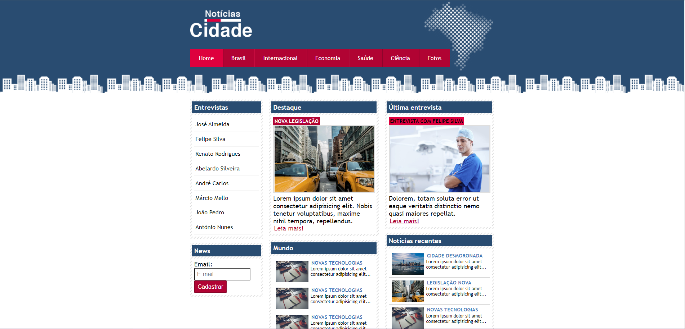

## 🏢  Notícias Cidade

Um site simples para conteúdos relacionados a tal cidade e o mundo.
Projeto do curso do Jamilton Damasceno feito pra colocar o CSS em dia. 

<h5>Feito com recursos intermediários para avançados de CSS. Site com layout fixo.</h5>

	

